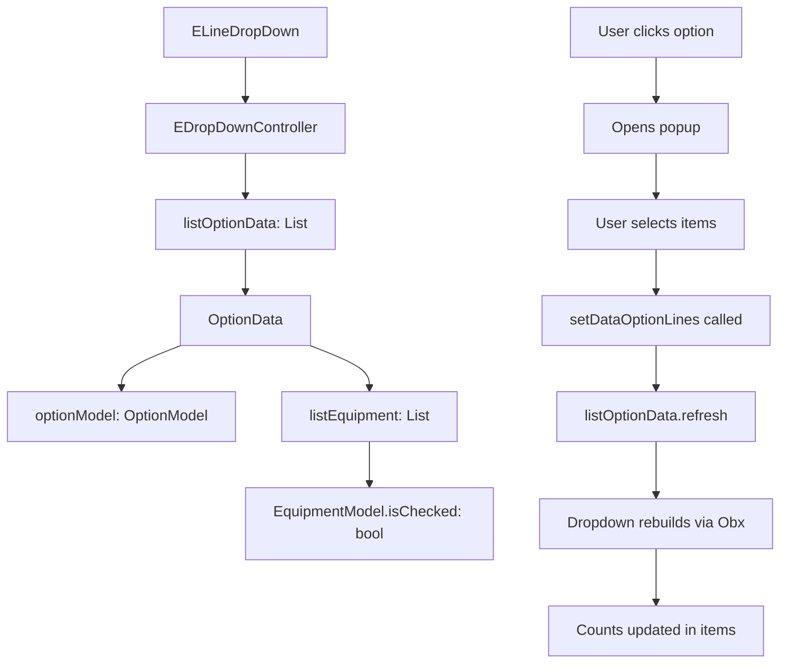

# Dropdown Item Count Display Specification

## Mục tiêu

Hiển thị số lượng cột/thiết bị đã chọn bên cạnh mỗi option trong `ELineDropDown`. Ví dụ: "Gẫy đổ (2)", "Nghiêng (3)"...

## Use Case

**Trước khi có tính năng:**
```
Dropdown "Tình trạng":
━━━━━━━━━━━━━━━━━━━━━━━━
  Đảm bảo vận hành
  Gẫy đổ
  Nghiêng
  Biến dạng
  Hư hỏng
━━━━━━━━━━━━━━━━━━━━━━━━
```

**Sau khi có tính năng:**
```
Dropdown "Tình trạng":
━━━━━━━━━━━━━━━━━━━━━━━━
  Đảm bảo vận hành
  Gẫy đổ (5)          ← Đã chọn 5 cột
  Nghiêng (2)         ← Đã chọn 2 cột  
  Biến dạng
  Hư hỏng (1)         ← Đã chọn 1 cột
  Nứt
  Vỡ bê tông
  Gỉ
━━━━━━━━━━━━━━━━━━━━━━━━
```

## Kiến trúc dữ liệu

### Data Flow



### Class Structure

```dart
class OptionData {
  OptionModel optionModel;        // Option info (title, value)
  List<EquipmentModel> listEquipment;  // List of equipment/poles
  String title;
}

class EquipmentModel {
  String id;
  String name;
  bool isChecked;  // ← Key field for counting
  String groupId;
  // ... other fields
}

class EDropDownController extends GetxController {
  RxList<OptionData> listOptionData = <OptionData>[].obs;  // Observable list
  RxInt selectedValue = 0.obs;
  // ... other fields
}
```

## Implementation Plan

### Bước 1: Thêm logic đếm items trong dropdown items

**File:** `lib/src/htld/screens/grid_management/containers/e_line_drop_down.dart`

**Location:** `_buildPhone()` method, inside `Obx()` widget

**Changes:**

```dart
items: options.map((e) {
  // Count selected items for this option
  final optionData = controller.listOptionData.firstWhere(
    (data) => data.optionModel.value == e.value,
    orElse: () => null,
  );
  final selectedCount = optionData?.listEquipment
      ?.where((equipment) => equipment.isChecked == true)
      ?.length ?? 0;
  
  // Build display text with count
  final displayText = selectedCount > 0 
      ? '${e.title} ($selectedCount)'
      : e.title;
  
  return DropdownMenuItem(
      value: e.value,
      child: Text(
        displayText,
        style: TextStyle(
            color: e.value == options.first.value ||
                    e.value == LineContentOption.na
                ? Colors.black
                : Colors.red),
      ));
}).toList(),
```

**Giải thích:**
- Tìm `OptionData` tương ứng với option hiện tại
- Đếm số equipment có `isChecked == true`
- Nếu count > 0, thêm số vào text: `"${e.title} ($selectedCount)"`
- Nếu count = 0, chỉ hiển thị title gốc

### Bước 2: Thêm trigger để rebuild dropdown

**File:** `lib/src/htld/screens/grid_management/containers/e_line_drop_down.dart`

**Location:** `_buildPhone()` method, inside `Obx()` callback

**Changes:**

```dart
Obx(
  () {
    // Trigger rebuild when listOptionData changes
    controller.listOptionData.length;
    
    return DropdownButtonFormField(
      // ... rest of dropdown configuration
    );
  },
)
```

**Giải thích:**
- Thêm `controller.listOptionData.length;` để force Obx track changes
- Khi `listOptionData` thay đổi, Obx sẽ tự động rebuild
- Điều này đảm bảo số lượng được cập nhật real-time

### Bước 3: Refresh listOptionData khi data thay đổi

**File:** `lib/src/htld/screens/grid_management/containers/e_line_drop_down.dart`

**Location:** `EDropDownController.setDataOptionLines()` method

**Changes:**

```dart
void setDataOptionLines(OptionData data) {
  listOptionData
      .firstWhere(
          (element) => element.optionModel.value == data.optionModel.value,
          orElse: () => null)
      ?.listEquipment
      ?.assignAll(data.listEquipment);
  optionDataSelected.value = data;
  optionEquipmentsSelected.assignAll(optionDataSelected.value.listEquipment);
  optionEquipmentsSelected.refresh();
  listOptionData.refresh(); // ← Thêm dòng này
  update();
}
```

**Giải thích:**
- Sau khi user chọn/bỏ chọn items trong popup
- `setDataOptionLines()` được gọi để update data
- Thêm `listOptionData.refresh()` để trigger Obx rebuild
- Dropdown sẽ tự động cập nhật số lượng

### Bước 4: Refresh dropdown khi đóng popup (kể cả khi click close)

**File:** `lib/src/htld/screens/grid_management/containers/e_line_drop_down.dart`

**Location:** `_transformerSelected()` method, sau khi đóng popup

**Changes:**

```dart
// Trường hợp chọn từng đoạn cột
final value = await showCheckListLine(
    context,
    _RenderListSubstationChooseAreas(data, enable: enable),
    'Chọn đoạn cột',
    enable: enable);
if (value != null) {
  final isNormal = options.first.value == controller.selectedValue.value ||
      LineContentOption.na == controller.selectedValue.value;
  controller.setDataOptionLines(value);
  onDataChange(controller.optionDataSelected.value, index,
      controller.lineWeirdoMessage, controller.listOptionData, !isNormal);
}
// ← THÊM DÒNG NÀY: Refresh kể cả khi user click close
controller.listOptionData.refresh();

// Tương tự cho trường hợp chọn nhiều cột
final value = await showCheckListLine(
    context,
    _RenderListSubstation(data, enable: enable),
    isUndergroundCable ? 'Chọn đoạn cáp ngầm' : 'Chọn cột',
    enable: enable);
if (value != null) {
  // ... update logic
}
// ← THÊM DÒNG NÀY
controller.listOptionData.refresh();
```

**Giải thích:**
- Khi user click "Lưu", `value != null` → data được update và refresh
- Khi user click "Close/Back", `value == null` → data không update (đúng behavior)
- **NHƯNG** vẫn cần refresh dropdown để đảm bảo UI hiển thị đúng số lượng hiện tại
- Điều này đảm bảo không có state mismatch giữa controller và UI

**Why this is important:**
- Nếu không refresh khi close, dropdown có thể hiển thị số lượng cũ không chính xác
- Refresh đảm bảo UI luôn sync với data trong controller
- Performance impact: Minimal, chỉ rebuild dropdown items

## Testing Plan

### Test Case 1: Hiển thị số lượng khi có items được chọn

**Steps:**
1. Mở popup "Tình trạng"
2. Chọn option "Gẫy đổ"
3. Popup chọn cột hiện ra
4. Chọn 3 cột
5. Click "Lưu"
6. Click vào dropdown "Tình trạng"

**Expected Result:**
- Dropdown hiển thị: "Gẫy đổ (3)"

### Test Case 2: Không hiển thị số khi count = 0

**Steps:**
1. Mở popup "Tình trạng"
2. Chọn option "Nghiêng"
3. Popup chọn cột hiện ra
4. Không chọn cột nào
5. Click "Lưu"
6. Click vào dropdown "Tình trạng"

**Expected Result:**
- Dropdown hiển thị: "Nghiêng" (không có số)

### Test Case 3: Cập nhật số lượng khi thay đổi selection

**Steps:**
1. Chọn "Gẫy đổ" với 5 cột
2. Click vào dropdown → thấy "Gẫy đổ (5)"
3. Click lại vào "Gẫy đổ" để edit
4. Bỏ chọn 2 cột (còn 3 cột)
5. Click "Lưu"
6. Click vào dropdown

**Expected Result:**
- Dropdown hiển thị: "Gẫy đổ (3)"

### Test Case 4: Reset về 0 khi chọn option "Đảm bảo vận hành"

**Steps:**
1. Chọn "Gẫy đổ" với 5 cột
2. Chọn lại "Đảm bảo vận hành"
3. Click vào dropdown

**Expected Result:**
- "Gẫy đổ" hiển thị không có số (reset về 0)
- "Đảm bảo vận hành" được chọn

### Test Case 5: Click Close không lưu changes

**Steps:**
1. Chọn "Gẫy đổ" với 5 cột
2. Click vào dropdown → thấy "Gẫy đổ (5)"
3. Click lại vào "Gẫy đổ" để edit
4. Trong popup, bỏ chọn 3 cột (còn 2 cột đang check)
5. **Click nút Close/Back** (KHÔNG click "Lưu")
6. Click vào dropdown

**Expected Result:**
- Dropdown vẫn hiển thị: "Gẫy đổ (5)" (giữ nguyên số cũ)
- Changes trong popup bị discard
- Khi mở lại popup, vẫn thấy 5 cột được chọn như ban đầu

**Why this behavior is correct:**
- User không click "Lưu" → changes không được apply
- Dropdown phải hiển thị đúng state hiện tại trong controller
- Refresh sau khi close popup đảm bảo không có UI glitch

## Code Review Checklist

- [ ] Dropdown items hiển thị đúng số lượng
- [ ] Số lượng cập nhật real-time khi user chọn/bỏ chọn
- [ ] **Click Close popup:** Số lượng vẫn hiển thị đúng (không bị glitch)
- [ ] Performance: Không lag khi render dropdown với nhiều options
- [ ] Edge cases:
  - [ ] Count = 0 → không hiển thị số
  - [ ] Count > 0 → hiển thị "(count)"
  - [ ] Reset về "Đảm bảo vận hành" → clear counts
  - [ ] Click Close trong popup → giữ nguyên số cũ
- [ ] Code style: Follow existing conventions
- [ ] GetX reactive: Sử dụng đúng .obs và .refresh()

## Performance Considerations

### Tính toán count trong build method

**Potential Issue:**
- Mỗi lần build, count được tính lại cho TẤT CẢ options
- Với nhiều options (8-10 options) và nhiều equipment (100+ items), có thể lag

**Current Solution:**
- Count operation là O(n) với n = số equipment per option
- Flutter's dropdown chỉ render khi cần (lazy)
- Acceptable performance cho use case hiện tại

**Future Optimization (nếu cần):**
```dart
// Cache counts trong controller
class EDropDownController extends GetxController {
  RxMap<int, int> optionCounts = <int, int>{}.obs;
  
  void updateCounts() {
    final counts = <int, int>{};
    listOptionData.forEach((optionData) {
      counts[optionData.optionModel.value] = optionData.listEquipment
          ?.where((e) => e.isChecked)
          ?.length ?? 0;
    });
    optionCounts.value = counts;
  }
}

// Trong dropdown items:
final displayText = (controller.optionCounts[e.value] ?? 0) > 0
    ? '${e.title} (${controller.optionCounts[e.value]})'
    : e.title;
```

## Future Enhancements

### 1. Customizable Format

Cho phép customize format hiển thị:
```dart
// Option 1: Số trước
"(5) Gẫy đổ"

// Option 2: Số sau (current)
"Gẫy đổ (5)"

// Option 3: Icon + số
"Gẫy đổ ⚡ 5"
```

### 2. Color Coding

Thêm màu sắc dựa trên số lượng:
```dart
// 0 items: black
// 1-5 items: orange
// >5 items: red
```

### 3. Tooltip

Thêm tooltip hiển thị danh sách items khi hover:
```dart
"Gẫy đổ (5)"
  ↓ hover
  "Cột 1, Cột 3, Cột 5, Cột 7, Cột 9"
```

## Related Files

- [`lib/src/htld/screens/grid_management/containers/e_line_drop_down.dart`](file:///Volumes/Work/ProjectInGithub/22-ctw-mobile-master/lib/src/htld/screens/grid_management/containers/e_line_drop_down.dart) - Main implementation
- [`lib/src/htld/screens/grid_management/medium_voltage_line/day/popups/line_day_poles_popup.dart`](file:///Volumes/Work/ProjectInGithub/22-ctw-mobile-master/lib/src/htld/screens/grid_management/medium_voltage_line/day/popups/line_day_poles_popup.dart) - Usage example
- [`lib/src/htld/models/equipment_model.dart`](file:///Volumes/Work/ProjectInGithub/22-ctw-mobile-master/lib/src/htld/models/equipment_model.dart) - Data model

## Git Commit History

1. **Initial Implementation** (Dec 21, 2025)
   - Added count display logic in dropdown items
   - Added trigger for reactive rebuild
   - Added refresh call in setDataOptionLines
   - Commit: "Add item count display to ELineDropDown"

## Notes

- Tính năng này chỉ áp dụng cho `ELineDropDown`, không áp dụng cho `EDropDown` thông thường
- Số lượng chỉ hiển thị cho các option "bất thường" (không hiển thị cho "Đảm bảo vận hành" hay "N/A")
- Format hiển thị: `${title} ($count)` với space trước dấu ngoặc
