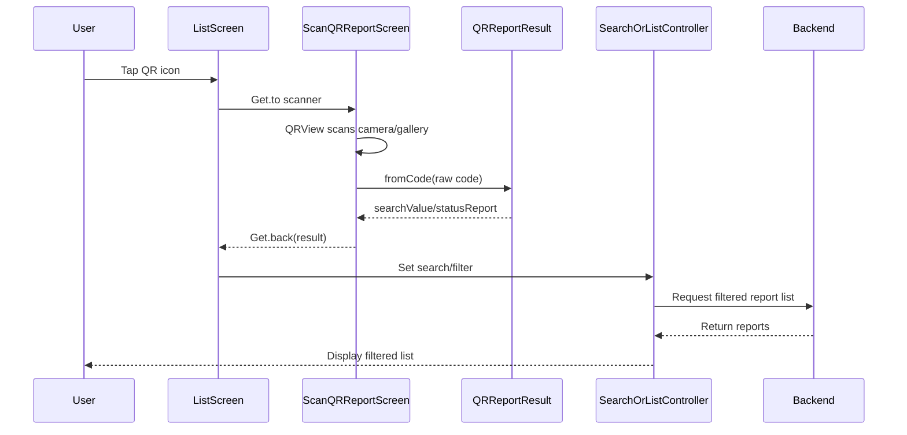

# MODULE 5: Tạo & Quét QR Code Biên Bản

## 1. Tổng quan nghiệp vụ

Module này bổ sung luồng quét QR Code biên bản để người dùng tìm nhanh biên bản/công việc liên quan trên app mobile. QR sau khi quét được parse thành `QRReportResult`, lấy giá trị tìm kiếm hoặc `id` biên bản, sau đó app áp vào màn danh sách/tìm kiếm biên bản để gọi API lọc dữ liệu.

Trong code hiện tại, các file theo tên `report_new/scan_qr/scan_qr_new_screen.dart`, `pdf_view_new.dart`, `qr_code_view_new.dart` chưa tìm thấy. Logic thực tế đang nằm ở các file QR/PDF hiện hữu dưới `list_work`, `list_report`, `list_report_meter`, `report`, và `report_by_transformer`.

## 2. Phạm vi đã triển khai

- Quét QR Code biên bản trên App Mobile.
- Xử lý dữ liệu/deep link sau khi quét QR.
- Hiển thị PDF biên bản, trong đó QR nhúng trong PDF phụ thuộc file PDF do Backend trả về.

## 3. Danh sách file liên quan

| STT | File | Vai trò trong task |
|---|---|---|
| 1 | `lib/src/qltnkd/screens/verification_report/list_work/scan_qr/scan_qr_report_screen.dart` | Màn hình quét QR biên bản bằng camera hoặc ảnh từ thư viện. |
| 2 | `lib/src/qltnkd/models/qr_report_result.dart` | Model/parser cho QR biên bản, parse JSON/query/UUID/raw code và map trạng thái từ `subPath`. |
| 3 | `lib/src/qltnkd/screens/verification_report/report_by_transformer/report_by_transformer.dart` | Đặt icon QR trên AppBar màn `Danh sách biên bản`, cạnh icon tìm kiếm; áp filter trực tiếp sau scan. |
| 4 | `lib/src/qltnkd/screens/verification_report/report_by_transformer/report_by_transformer_controller.dart` | Nhận `searchTerm/statusReport` và gọi API `/mergeformreport`. |
| 5 | `lib/src/qltnkd/screens/verification_report/list_report/list_report_screen.dart` | Đặt icon QR cạnh icon tìm kiếm; sau scan mở `SearchReportScreen`. |
| 6 | `lib/src/qltnkd/screens/verification_report/list_report/search_report/search_report_screen.dart` | Nhận `initialSearchTerm` từ QR và tự load danh sách biên bản theo từ khóa/id. |
| 7 | `lib/src/qltnkd/screens/verification_report/list_report/tab/tab_report_controller.dart` | Build request lọc biên bản thường, tách GUID sang param `Id`, còn lại dùng `SearchTerm`. |
| 8 | `lib/src/qltnkd/screens/verification_report/list_report_meter/list_report_meter_screen.dart` | Đặt icon QR cạnh icon tìm kiếm cho danh sách biên bản công tơ; sau scan mở search công tơ. |
| 9 | `lib/src/qltnkd/screens/verification_report/list_report_meter/search_report/search_report_meter_screen.dart` | Nhận `initialSearchTerm` từ QR và tự search biên bản công tơ. |
| 10 | `lib/src/qltnkd/screens/verification_report/list_report_meter/tab/tab_report_meter_controller.dart` | Build request lọc biên bản công tơ, tách GUID sang param `id`, còn lại dùng `searchTerm`. |
| 11 | `lib/src/qltnkd/services/responsitory/merge_form_report_repository.dart` | API repository cho biên bản thường, endpoint `/mergeformreport`. |
| 12 | `lib/src/qltnkd/services/responsitory/bb_cong_to_repository.dart` | API repository cho biên bản công tơ, endpoint `/mergeformreport` và `/common/get-pdf-meter`. |
| 13 | `lib/src/qltnkd/screens/verification_report/list_report/pdf_view/pdf_view.dart` | Màn xem PDF biên bản thường. |
| 14 | `lib/src/qltnkd/screens/verification_report/list_report/pdf_view/r_pdf_view_controller.dart` | Lấy URL PDF từ Backend, download PDF, render PDF trên Android qua native channel. |
| 15 | `lib/src/qltnkd/screens/verification_report/list_report_meter/pdf_view/pdf_report_view.dart` | Màn xem PDF biên bản công tơ. |
| 16 | `lib/src/qltnkd/screens/verification_report/list_report_meter/pdf_view/pdf_view_meter_controller.dart` | Lấy URL PDF công tơ và render tương tự PDF thường. |
| 17 | `lib/src/qltnkd/common/components/item_merge_report.dart` | Item biên bản trong danh sách, có action `Xem PDF`/icon PDF mở `RPdfScreen`. |
| 18 | `lib/src/qltnkd/common/components/item_work_new.dart` | Item biên bản/công việc dạng mới, có action mở PDF tương tự. |
| 19 | `lib/src/qltnkd/screens/verification_report/report_by_transformer/widgets/item_report_by_transformer.dart` | Item biên bản theo trạm, có action mở PDF/giấy chứng nhận. |
| 20 | `lib/src/qltnkd/screens/verification_report/report/component/qr_code_view.dart` | Component QR trong form nhập biên bản, dùng để scan QR thiết bị, không phải component render QR trong PDF. |
| 21 | `lib/src/qltnkd/screens/verification_report/report/scan_qr/scan_qr_screen.dart` | Màn scan QR thiết bị cho `QRCodeView`, parse `QRResultModel`. |
| 22 | `lib/src/qltnkd/models/qr_code_model.dart` | Model QR thiết bị `QRResultModel`; không phải model QR biên bản. |
| 23 | `android/app/src/main/kotlin/com/example/evnmobile/MainActivity.kt` | Native Android render từng trang PDF thành ảnh JPG qua PDFBox. |
| 24 | `lib/routes.dart` | Định nghĩa route chung; chưa thấy route named riêng cho `ScanQRReportScreen`, màn này đang mở trực tiếp bằng `Get.to`. |

## 4. Flow tổng thể sau khi triển khai

1. Người dùng vào màn danh sách biên bản như `ReportByTransformer`, `ListReportScreen`, hoặc `ListReportMeterScreen`.
2. Người dùng bấm icon `Icons.qr_code_scanner` trên AppBar, đặt cạnh icon tìm kiếm.
3. App mở `ScanQRReportScreen` bằng `Get.to(() => const ScanQRReportScreen())`.
4. `QRView` dùng camera thiết bị để scan QR.
5. App nhận raw QR data từ `scanData.code`.
6. `QRReportResult.fromCode(code)` parse raw data.
7. App lấy `searchValue`; giá trị này ưu tiên `searchTerm`, nếu không có thì dùng `reportId`.
8. App quay về màn gọi scan bằng `Get.back(result: qrResult)`.
9. Màn gọi scan áp `searchValue` vào search/filter:
   - `ReportByTransformer`: set `_controller.searchTerm.value`, set `_controller.statusReport`, gọi `_controller.getWorkMerge()`.
   - `ListReportScreen`: mở `SearchReportScreen(initialSearchTerm: result.searchValue)`.
   - `ListReportMeterScreen`: mở `SearchReportMeterScreen(initialSearchTerm: result.searchValue)`.
10. Controller gọi Backend để load danh sách đã lọc và UI hiển thị kết quả hoặc trạng thái trống.



## 5. Logic quét QR Code

Màn scan QR biên bản nằm tại `ScanQRReportScreen` trong `lib/src/qltnkd/screens/verification_report/list_work/scan_qr/scan_qr_report_screen.dart`.

Scanner/camera sử dụng package `qr_code_scanner` với widget `QRView`. App cũng hỗ trợ chọn ảnh từ thư viện bằng `image_picker`, sau đó decode QR trong ảnh bằng `Scan.parse(image.path)` từ package `scan`.

Các điểm chính:

- AppBar có title `Quét mã QR Biên Bản`.
- Có nút bật/tắt flash qua `controller?.toggleFlash()`.
- `QRView` dùng `QrScannerOverlayShape`, scan area là `200` trên màn nhỏ và `300` trên màn lớn.
- Khi `onQRViewCreated` chạy, controller được lưu vào state, Android gọi `pauseCamera()` rồi `resumeCamera()` để khởi động lại camera ổn định.
- Raw data lấy từ `scanData.code`.
- Chống scan lặp bằng biến `bool isProcessing`. Khi bắt đầu xử lý scan thì set `true`; chỉ reset về `false` khi lỗi hoặc cần quét lại.
- Khi parse thành công và có `searchValue`, màn scan đóng bằng `Get.back(result: qrResult)`.
- Nếu QR không hợp lệ hoặc không có thông tin biên bản, hiển thị dialog bằng `rShowDialogOneButton`.
- Nếu không cấp quyền camera, `_onPermissionSet` hiển thị SnackBar `Vui lòng cấp quyền sử dụng Camera`.
- `dispose()` gọi `controller?.dispose()`.

## 6. Logic parse QR/deep link

Logic parse QR biên bản nằm trong `QRReportResult.fromCode` tại `lib/src/qltnkd/models/qr_report_result.dart`.

Format QR đang được hỗ trợ theo code:

- JSON string:
  - `searchTerm`
  - `reportId` hoặc `id`
  - `subPath`
- URL hoặc chuỗi có query string:
  - `?searchTerm=...`
  - `?reportId=...`
  - `?id=...`
  - `?subPath=...`
- Chuỗi có UUID nằm ở bất kỳ vị trí nào.
- Chuỗi raw dài hơn 10 ký tự và không chứa khoảng trắng, được xem như `reportId`.

Chi tiết parse:

- `_fromJson(code)` thử `jsonDecode(code)` trước. Nếu có `searchTerm` hoặc `reportId/id` thì return `QRReportResult`.
- Nếu không phải JSON, `_extractQueryParameters(code)` tự cắt phần sau dấu `?` đến trước `#`, split theo `&`, decode bằng `Uri.decodeQueryComponent`.
- Nếu query có `searchTerm` hoặc `reportId/id`, model lưu các giá trị đó.
- Nếu không có query hợp lệ, dùng regex UUID để tìm `reportId`.
- Nếu vẫn không có UUID, chuỗi raw dài hơn 10 ký tự và không có khoảng trắng sẽ được xem là `reportId`.
- `searchValue` ưu tiên `searchTerm.trim()`, sau đó mới dùng `reportId`.
- `statusReport` map từ `subPath` sang `ReportStatusType`, gồm `doing/implementing`, `rejected`, `waiting-for-team-approval`, `waiting-for-center-approval`, `waiting-for-company-approval`, `completed/done`.

Lưu ý quan trọng:

- Code hiện không parse path segment của URL bằng `Uri.pathSegments`; nếu Backend nhúng `id` trong path nhưng không có UUID rõ ràng thì phụ thuộc fallback raw string/UUID.
- `subPath` chỉ được lấy từ JSON hoặc query param, không tự lấy từ path URL.
- Model `QRResultModel` trong `qr_code_model.dart` là model QR thiết bị, không phải parser chính cho QR biên bản.
- Format QR/deep link cuối cùng vẫn phụ thuộc Backend cung cấp đúng `searchTerm`, `reportId/id`, UUID hoặc raw id.

## 7. Logic điều hướng sau khi scan

`ScanQRReportScreen` không được khai báo named route riêng trong `routes.dart`. Các màn liên quan mở trực tiếp bằng `Get.to(() => const ScanQRReportScreen())`.

Luồng điều hướng thực tế:

- `ReportByTransformer`:
  - Bấm QR icon.
  - `await Get.to(() => const ScanQRReportScreen())`.
  - Nếu result là `QRReportResult`, set `searchTerm/statusReport`, gọi `getWorkMerge()`.
  - Không mở màn mới sau khi scan; danh sách hiện tại reload theo filter.
- `ListReportScreen`:
  - Bấm QR icon.
  - Mở scanner.
  - Nếu result hợp lệ, mở `SearchReportScreen(initialSearchTerm: result.searchValue)`.
  - Không truyền `statusReport` từ QR vào `SearchReportScreen` trong code hiện tại.
- `ListReportMeterScreen`:
  - Bấm QR icon.
  - Mở scanner.
  - Nếu result hợp lệ, mở `SearchReportMeterScreen(initialSearchTerm: result.searchValue)`.

`routes.dart` hiện chỉ có route named `Routes.interScanQRScreen` trỏ tới `ScanQrCodeScreen` của module HTLD, không phải scanner QR biên bản `ScanQRReportScreen`.

## 8. Logic lọc danh sách công việc theo QR

### ReportByTransformer

File: `lib/src/qltnkd/screens/verification_report/report_by_transformer/report_by_transformer.dart`.

Sau scan:

- `_controller.searchTerm.value = result.searchValue`
- `_controller.statusReport = result.statusReport ?? ReportStatusType.all.toString()`
- `await _controller.getWorkMerge()`

Controller `ReportByTransformerController.getWorkMerge()` gọi `MergerFormReportRepository.getReports()` với params chính:

- `WorkingStatus`: từ `statusReport`, nếu `0` thì gửi `null`.
- `SearchTerm`: từ `searchTerm.value`.
- `FromDate`, `ToDate`.
- `UnitId`.
- `EquipmentTypeId`, `EquipmentDetailId`.
- `IsPaperFormReport`.
- `pageIndex`, `pageSize`, `orderBy`.

Màn này không tách GUID sang param `Id`; kể cả QR trả UUID thì vẫn truyền qua `SearchTerm`.

### ListReportScreen/SearchReportScreen

File: `lib/src/qltnkd/screens/verification_report/list_report/list_report_screen.dart` và `search_report/search_report_screen.dart`.

Sau scan:

- Mở `SearchReportScreen(initialSearchTerm: result.searchValue)`.
- Trong `SearchReportScreen.initState()`:
  - Clear `fromDate`, `toDate`, `unit`, `searchTerm` của `listReportController`.
  - Set `_searchController.text`.
  - Set `_controller.searchTerm.value`.
  - Gọi `_controller.getWorkMerge(ListTypeLoad.refresh)`.

Trong `TabReportController.getWorkMerge()`:

- Trim search term.
- Nếu term là GUID đúng format thì gọi repository với `id: trimmedTerm` và `searchTerm: null`.
- Nếu không phải GUID thì gọi với `searchTerm: trimmedTerm`.
- Gọi endpoint `/mergeformreport` qua `MergerFormReportRepository.getReports()`.

### ListReportMeterScreen/SearchReportMeterScreen

File: `lib/src/qltnkd/screens/verification_report/list_report_meter/list_report_meter_screen.dart` và `search_report/search_report_meter_screen.dart`.

Sau scan:

- Mở `SearchReportMeterScreen(initialSearchTerm: result.searchValue)`.
- Search screen set `_controller.searchTerm.value`.
- Gọi `_controller.search(ListTypeLoad.refresh)`.

Trong `TabReportMeterController.search()`:

- Nếu term là GUID thì truyền `id`.
- Nếu không phải GUID thì truyền `searchTerm`.
- Gọi `BBCongToRepository.getReports()`.

Nếu không có dữ liệu:

- Các màn list/search dùng điều kiện list rỗng và `isFirstLoad` để hiển thị `RAppStrings.emptyData` hoặc `Danh sách trống`.
- Nếu API lỗi, controller hiển thị dialog/snackbar theo response message.

## 9. Logic hiển thị QR trong PDF biên bản

PDF biên bản thường mở bằng `RPdfScreen` trong `lib/src/qltnkd/screens/verification_report/list_report/pdf_view/pdf_view.dart`.

PDF biên bản công tơ mở bằng `PdfMeterScreen` trong `lib/src/qltnkd/screens/verification_report/list_report_meter/pdf_view/pdf_report_view.dart`.

### 9.1. Vì sao QR từ API hiển thị được trong PDF

Khi người dùng vào mục `Danh sách biên bản` và bấm icon PDF trên một item biên bản, QR hiển thị được trong file PDF vì QR đã được Backend nhúng trực tiếp vào nội dung file PDF trước khi trả URL PDF cho mobile. App mobile không tự generate QR trong màn PDF và cũng không overlay QR lên PDF sau khi tải về.

Luồng thực tế:

1. Người dùng bấm icon PDF hoặc action `Xem PDF` trên item biên bản trong danh sách.
2. Item mở màn `RPdfScreen`, truyền vào `id` biên bản và `code`/số biên bản.
3. `RPdfScreen.initState()` gọi `_controller.getPdf(widget.id)` nếu không có sẵn `widget.link`.
4. `RPdfController.getPdf()` gọi `ReportRepository.getPdf(...)`.
5. `ReportRepository.getPdf()` gọi API Backend `POST /common/get-pdf` với body:

```dart
{
  'FormReportId': formReportId,
  'isGroup': isViewPDFUnscheduled ? null : isGroup
}
```

6. Backend generate hoặc lấy file PDF đã có QR nhúng sẵn, sau đó trả về URL PDF trong `data`.
7. Mobile nhận URL PDF, tải hoặc mở PDF và render nguyên trang PDF.
8. Vì QR là một phần của page PDF gốc, QR được hiển thị cùng logo, bảng biểu, watermark và nội dung biên bản.

Điểm mấu chốt: QR hiển thị thành công là kết quả phối hợp giữa Backend và mobile. Backend chịu trách nhiệm tạo PDF có QR; mobile chịu trách nhiệm lấy đúng URL PDF và render đầy đủ trang PDF.

Logic thực tế:

- Nếu widget nhận `link` thì dùng trực tiếp URL đó.
- Nếu không có `link`, controller gọi Backend:
  - Biên bản thường: `ReportRepository.getPdf(formReportId: id, isGroup: !isMonitor, isViewPDFUnscheduled: ...)`, endpoint `/common/get-pdf`.
  - Biên bản công tơ: `BBCongToRepository.getPdf(formReportId: id)`, endpoint `/common/get-pdf-meter`.
- Backend trả về URL PDF dạng string trong `data`.
- iOS: set `isSuccess = true`, hiển thị PDF URL bằng `WebView(initialUrl: urlPdf)`.
- Android:
  - Download PDF bằng `HttpClient().getUrl(Uri.parse(urlPdf))`, timeout 30 giây.
  - Lưu file vào `getApplicationDocumentsDirectory()`.
  - Gọi native method channel `com.evn.pmis/pdf`, method `renderImage`.
  - Native Android trong `MainActivity.kt` dùng `PDFRenderer(document).renderImage(index, 2f, ImageType.RGB)`, nén từng trang thành JPEG quality `100`, trả danh sách path qua method `pdfResult`.
  - Flutter hiển thị từng page bằng `Image.file(File(path))` trong `ListView.separated`, bọc ngoài `InteractiveViewer(minScale: 1, maxScale: 2)`.

Về QR trong PDF:

- Chưa tìm thấy code Flutter tự tạo hoặc tự render QR riêng để nhúng vào PDF.
- QR trong PDF là phụ thuộc Backend: Backend phải tạo file PDF có QR nhúng sẵn.
- App chỉ render toàn bộ trang PDF. Nếu QR đã nằm đúng trong PDF, app sẽ hiển thị như một phần của ảnh trang PDF/WebView.
- `qr_code_view.dart` không phải component hiển thị QR trong PDF. Component này là icon scan QR trong form biên bản, dùng `ScanQRScreen` để scan QR thiết bị và fill dropdown/text theo `relationKey`.

### 9.2. Luồng Android render PDF có QR

Trên Android, app không dùng WebView để hiển thị trực tiếp PDF. Thay vào đó app render PDF thành ảnh từng trang:

1. `RPdfController._createFileOfPdfUrl()` tải PDF từ URL Backend về local file.
2. `RPdfController` gọi native channel:

```dart
pdfMethodChanel.invokeMethod<String>('renderImage', file.absolute.path);
```

3. `MainActivity.kt` nhận path file PDF, load bằng:

```kotlin
val document = PDDocument.load(File(filePart))
val renderer = PDFRenderer(document)
```

4. Với mỗi trang PDF, native render thành bitmap:

```kotlin
pageImage = renderer.renderImage(index, 2f, ImageType.RGB)
```

5. Bitmap được nén thành file JPG quality `100`, path ảnh được trả về Flutter qua method `pdfResult`.
6. Flutter nhận danh sách `parts` và hiển thị:

```dart
Image.file(File(_controller.parts[index]))
```

Do render nguyên page PDF, QR nhúng trong PDF cũng được chuyển thành pixel trong ảnh page. Đây là lý do ảnh PDF trên app vẫn thấy QR ở góc trái phía trên như screenshot.

### 9.3. Luồng iOS hiển thị PDF có QR

Trên iOS, controller set `isSuccess = true` sau khi có `urlPdf`; UI hiển thị:

```dart
WebView(initialUrl: _controller.urlPdf)
```

Do WebView mở trực tiếp PDF URL từ Backend, QR cũng hiển thị nếu file PDF gốc đã được Backend nhúng QR đúng.

### 9.4. Phân biệt QR scan trong form và QR nhúng trong PDF

Trong code hiện tại có hai khái niệm QR khác nhau:

- `QRCodeView` trong `report/component/qr_code_view.dart`: là icon scan QR thiết bị khi nhập/sửa form biên bản. Nó mở `ScanQRScreen`, parse `QRResultModel` từ `qr_code_model.dart`, rồi fill dữ liệu thiết bị vào field theo `relationKey`.
- QR trong PDF biên bản: không do `QRCodeView` tạo. QR này nằm sẵn trong file PDF Backend trả về từ `/common/get-pdf` hoặc `/common/get-pdf-meter`.

Vì vậy, việc PDF hiển thị QR không phụ thuộc `QRCodeView`. `QRCodeView` chỉ liên quan đến nhập liệu/scan thiết bị trong form.

Rủi ro/lưu ý render:

- Android convert PDF page sang JPEG; QR nhỏ có thể bị ảnh hưởng bởi scale render `2f` và nén JPEG, dù quality đang là `100`.
- Native Android xóa toàn bộ `cacheDir` trước khi render PDF mới bằng `context.cacheDir.deleteRecursively()`.
- Nếu native render lỗi, `renderFile()` trả list rỗng; Flutter không có thông báo lỗi riêng cho trường hợp `parts` rỗng.
- `InteractiveViewer` có `panEnabled: false`, zoom tối đa `2`, nên khả năng soi QR phụ thuộc kích thước ảnh render.
- Nếu download PDF lỗi/timeout, app hiển thị dialog `Có lỗi xảy ra khi tải file pdf`.

## 10. Phần phụ thuộc Backend

| Phần phụ thuộc | Frontend đang xử lý | Backend cần đảm bảo |
| -------------- | ------------------- | ------------------- |
| Format QR biên bản | Parse JSON, query `searchTerm/reportId/id/subPath`, UUID hoặc raw id. | QR phải chứa dữ liệu theo format app parse được. |
| Deep link URL | Frontend tự đọc query string sau dấu `?`; không parse path segment. | Nếu dùng URL, nên đưa `id/reportId/searchTerm/subPath` vào query hoặc chứa UUID rõ ràng. |
| Trạng thái biên bản | `QRReportResult.statusReport` map từ `subPath`. | `subPath` cần dùng đúng các key đang hỗ trợ như `implementing`, `rejected`, `completed`. |
| API lọc biên bản thường | Gọi `/mergeformreport` với `Id`, `SearchTerm`, `WorkingStatus`, date/unit/filter. | API cần hỗ trợ lọc đúng theo `Id` hoặc `SearchTerm`. |
| API lọc biên bản công tơ | Gọi repository công tơ với `id` hoặc `searchTerm`. | API công tơ cần hỗ trợ lọc đúng theo tham số tương ứng. |
| API lọc danh sách công việc | `ReportRepository.getListWork()` có `SearchTerm`, `ReportNumber`, filter khác; nhưng luồng QR biên bản hiện chủ yếu đi vào list/search biên bản. | Backend cần hỗ trợ filter nếu muốn QR áp trực tiếp sang danh sách công việc. |
| URL PDF thường | App gọi `/common/get-pdf`. | Backend trả URL PDF hợp lệ trong `data`. |
| URL PDF công tơ | App gọi `/common/get-pdf-meter`. | Backend trả URL PDF hợp lệ trong `data`. |
| QR nhúng trong PDF | App chỉ render PDF nguyên trang. | Backend phải nhúng QR vào PDF đúng vị trí, kích thước, không crop. |
| Nội dung QR trong PDF | Frontend không đọc/validate nội dung QR trong PDF viewer. | Backend cần encode đúng URL/deep link/id để QR scan lại được bằng `QRReportResult`. |
| Chất lượng QR trong PDF | Android render page PDF thành JPG ở scale `2f`, quality `100`; iOS mở PDF URL bằng WebView. | Backend cần tạo QR đủ lớn, tương phản tốt, không đặt quá sát mép/crop area. |

## 11. Edge cases đã xử lý / cần lưu ý

| Trường hợp | Đã xử lý trong code chưa | Ghi chú |
| ---------- | ------------------------ | ------- |
| QR rỗng | Có một phần | `scanData.code` phải là `String` và `isNotEmpty`; ảnh không có QR hiển thị `Không tìm thấy mã QR nào trong ảnh này.` |
| QR sai định dạng | Có | `_handleScanResult` catch lỗi và hiển thị `Mã QR không hợp lệ. Vui lòng quét lại.` |
| QR không phải QR biên bản | Có một phần | Nếu parse không ra `searchValue`, hiển thị `Không tìm thấy thông tin biên bản trong mã QR này.` |
| URL thiếu id/searchTerm | Có một phần | Có fallback UUID/raw code; nếu không match thì báo lỗi. |
| ID nằm trong path URL | Cần lưu ý | Không parse path segment; chỉ bắt được nếu path chứa UUID hoặc raw string đủ điều kiện. |
| Không tìm thấy biên bản | Có qua UI list rỗng | Search/list hiển thị `emptyData` hoặc `Danh sách trống`. |
| Không có công việc thuộc biên bản | Có qua UI list rỗng | Không có message riêng cho QR; phụ thuộc response/list rỗng. |
| Mất mạng khi gọi API | Có một phần | Một số controller fallback offline, một số màn công tơ báo `Vui lòng kiểm tra mạng`. |
| Không cấp quyền camera | Có | SnackBar `Vui lòng cấp quyền sử dụng Camera` trong scanner biên bản. |
| Scan trùng nhiều lần | Có | `isProcessing` chặn xử lý lặp. |
| Người dùng quay lại khi đang scan | Có cơ bản | `dispose()` hủy controller; không thấy logic đặc biệt khác. |
| Chọn ảnh nhưng hủy | Có | `_pickImageAndScan()` reset `isProcessing = false`. |
| PDF không load được | Có một phần | Download lỗi hiển thị dialog; render native lỗi trả list rỗng nhưng không báo rõ. |
| QR trong PDF không hiển thị | Chưa có kiểm tra riêng | App không validate QR trong PDF; phụ thuộc PDF Backend và renderer. |
| QR trong PDF bị crop/scale | Chưa có kiểm tra riêng | Android render nguyên page PDF thành ảnh, nhưng chưa thấy logic kiểm tra crop QR. |

## 12. Đánh giá logic hiện tại

Logic quét QR biên bản đã khá rõ: scanner tách riêng, model parse riêng, màn gọi scan tự quyết định áp filter hoặc mở search. Việc dùng `isProcessing` giúp tránh scan lặp, và hỗ trợ thêm scan từ ảnh là điểm tốt.

Điểm cần lưu ý là flow chưa hoàn toàn thống nhất:

- `ReportByTransformer` áp filter trực tiếp và có dùng `statusReport` từ QR.
- `ListReportScreen` và `ListReportMeterScreen` mở màn search mới, nhưng không truyền `statusReport` từ QR.
- Một số controller tách GUID sang param `Id`, trong khi `ReportByTransformerController` vẫn truyền UUID qua `SearchTerm`.
- `routes.dart` chưa có named route riêng cho QR biên bản; scanner đang được mở trực tiếp bằng `Get.to`.
- Các file `*_new` được nêu trong task chưa tìm thấy trong code hiện tại, nên tài liệu này bám theo file thực tế đang implement.

Phần PDF chủ yếu phụ thuộc Backend. App render toàn bộ PDF nên không có logic riêng đảm bảo QR nhúng đúng, ngoài việc download/render nguyên trang.

## 13. Checklist nghiệm thu task

- [ ] Icon QR hiển thị đúng cạnh icon tìm kiếm trên `ReportByTransformer`.
- [ ] Icon QR hiển thị đúng cạnh icon tìm kiếm trên `ListReportScreen`.
- [ ] Icon QR hiển thị đúng cạnh icon tìm kiếm trên `ListReportMeterScreen`.
- [ ] Bấm icon QR mở đúng `ScanQRReportScreen`.
- [ ] Camera scan được QR hợp lệ.
- [ ] Có thể scan QR từ ảnh trong thư viện.
- [ ] QR JSON được parse đúng qua `QRReportResult.fromCode`.
- [ ] QR URL query `searchTerm/reportId/id/subPath` được parse đúng.
- [ ] QR chứa UUID được nhận diện đúng.
- [ ] Lấy đúng `searchValue` từ QR.
- [ ] `ReportByTransformer` lọc đúng theo `searchTerm/statusReport`.
- [ ] `SearchReportScreen` lọc đúng theo `Id` khi QR trả UUID.
- [ ] `SearchReportScreen` lọc đúng theo `SearchTerm` khi QR trả từ khóa/số biên bản.
- [ ] `SearchReportMeterScreen` lọc đúng biên bản công tơ theo QR.
- [ ] PDF biên bản thường load được từ `/common/get-pdf`.
- [ ] PDF biên bản công tơ load được từ `/common/get-pdf-meter`.
- [ ] QR nhúng trong PDF hiển thị đúng trên Android.
- [ ] QR nhúng trong PDF hiển thị đúng trên iOS.
- [ ] PDF không bị mất/crop QR.
- [ ] Các lỗi cơ bản được xử lý: QR sai, không có QR trong ảnh, không cấp quyền camera, lỗi tải PDF.

## 14. Kết luận

Module QR biên bản hiện hoạt động theo hướng: người dùng bấm icon QR trên màn danh sách, app mở `ScanQRReportScreen`, đọc raw QR từ camera hoặc ảnh, parse bằng `QRReportResult`, rồi dùng `searchValue` để lọc danh sách biên bản. Tùy màn, app hoặc reload ngay danh sách hiện tại (`ReportByTransformer`) hoặc mở màn search với `initialSearchTerm` (`ListReportScreen`, `ListReportMeterScreen`).

Phần QR trong PDF không được app tạo riêng; app nhận URL PDF từ Backend và render nguyên trang PDF. Trong flow người dùng bấm PDF ở danh sách biên bản, Backend trả về file PDF đã có QR nhúng sẵn qua `/common/get-pdf`; Android render file đó thành ảnh từng trang bằng native PDFBox, còn iOS mở PDF URL bằng WebView. Vì QR đã là một phần của PDF page, mobile hiển thị được QR cùng toàn bộ nội dung biên bản. Việc QR có đúng nội dung, đúng vị trí và không bị crop trong file PDF là phụ thuộc Backend; frontend chịu trách nhiệm lấy đúng file và render đầy đủ trang PDF.
